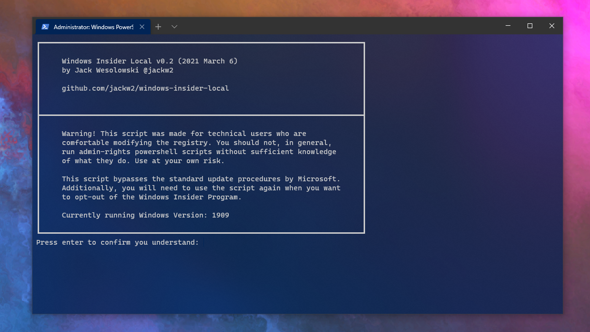
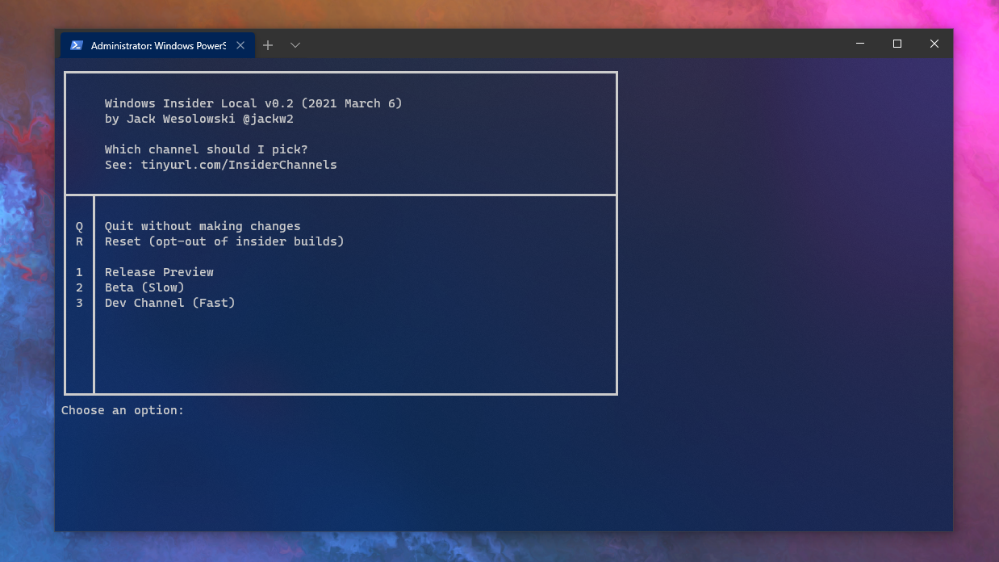

# Windows Insider for Local Accounts
A powershell script to allow local windows accounts to
join the Windows Insider Program without having to link
their Windows profile to a Microsoft Account.

⚠ Warning! This script was made for technical users
who are comfortable modifying the registry. You should not, in general, run
admin-rights powershell scripts without sufficient knowledge of what they do. Use at your own risk.

# How to use this script

1. Download `launch.ps1`

2. Open a powershell terminal in administrator mode,
`cd` to the directory where the script has been downloaded, and launch the script with `./launch.ps1`
>By default, powershell scripts are blocked on most PCs. You can temporarily
>bypass this restriction with the following command:
>
>PowerShell.exe -ExecutionPolicy Bypass -File ./launch.ps1

4. Select your desired insider channel from the menu

5. Reboot your computer

6. Go to `Settings > Update and Security > Windows Update` and check for updates

7. Kick back and enjoy a nice cup of tea while your computer updates 🍵

